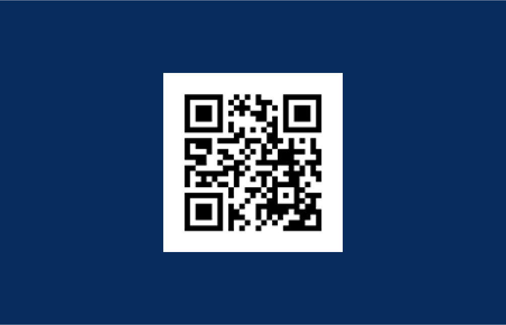

# Ma carte en réalité augmenté

## Explication de l'expérience

J'ai designé une carte de visite dans le but de représenter qui j'étais. Je me suis appuyée sur une de mes compétences que je voulais mettre en avant et j'ai donc choisi l'intégration web. Pour cela j'ai décidé de mettre en page mes informations sous forme de site web comme si on était dans le mode développeur d'un CMS. J'ai donc mis en avant le coté embrication d'éléments des CMS en m'inspirant des oeuvres de Mondrian. Puis j'ai décidé de mettre les éléments sur plusieurs plans en m'inspirant de Mozilla Developer Network et j'ai finalement obtenu le résultat ci dessous.

  
  

## Carte de visite

## QR code lien acces expérience AR

[acces à l'expérience à partir de la carte de visite](https://marionsauviat.github.io/aframecard/ "Titre")  

